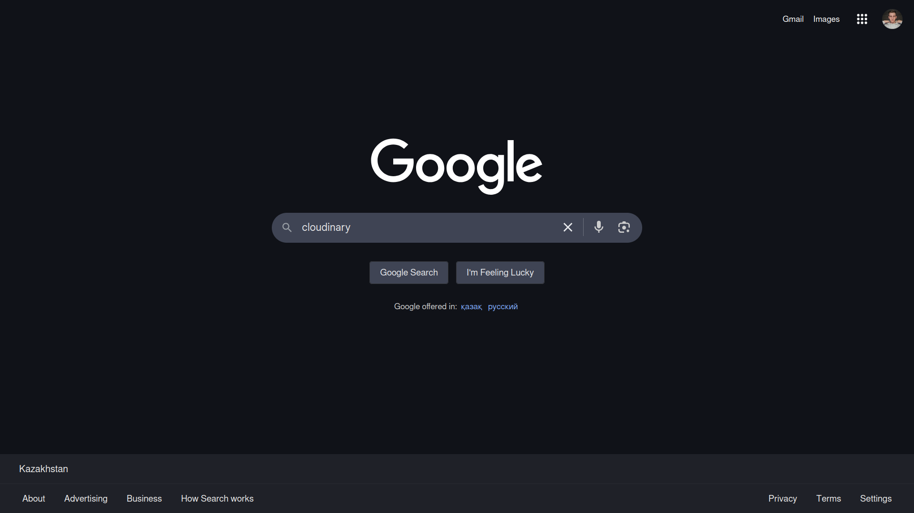
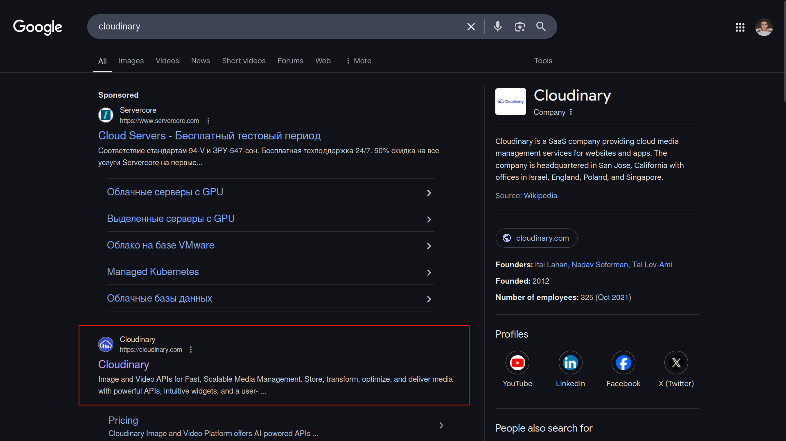
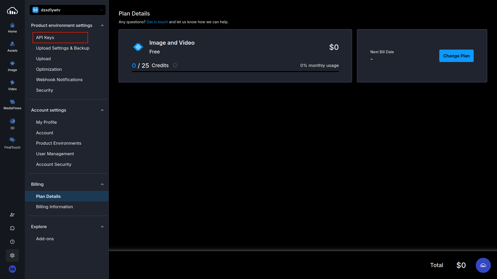
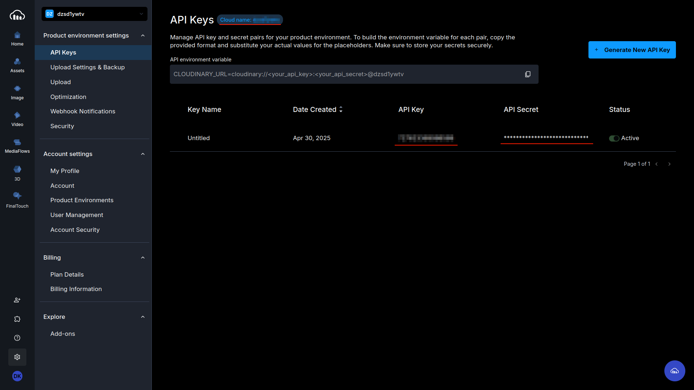

### 01. Search for Cloudinary

### 02. Open the Official Website

### 03. Sign Up to Your Account

### 04. Go to Settings

### 05. Go to API Keys

### 06. Copy and Paste Credentials to Environmental Variables
You have:
- **Cloud Name**
- **API Key**
- **API Secret**

Paste them into your `.env`.

