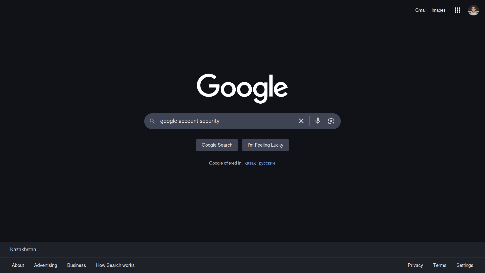
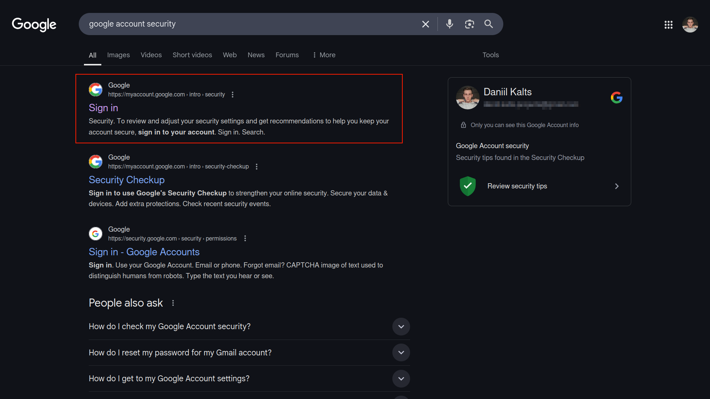
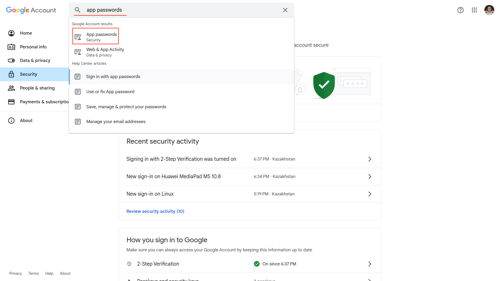
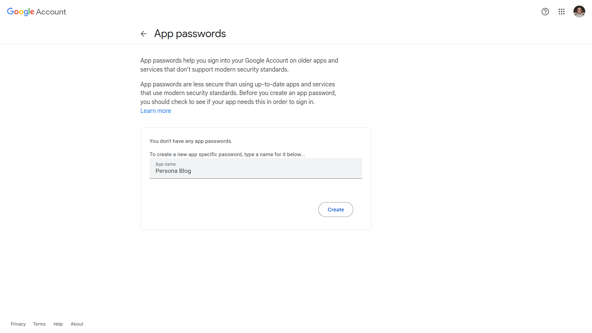
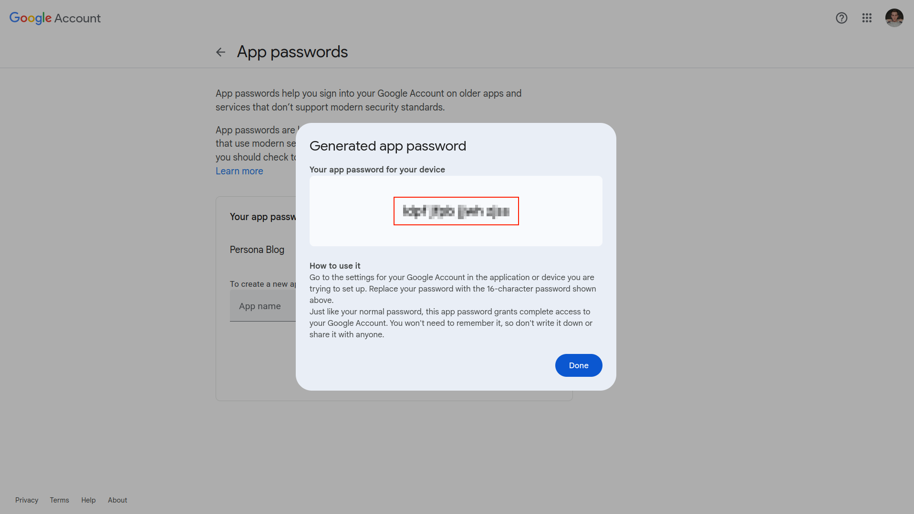

### 01. Search for Google Account Security

### 02. Open the Official Website

### 03. Open Security and Search for "App Passwords"

Before that make sure you have 2-Step Verification Enabled in Your Account

### 04. Set App Password Name

### 06. Copy and Paste the Password to Environmental Variables
You have:
- **Mail Password**

Paste it into your `.env`.

