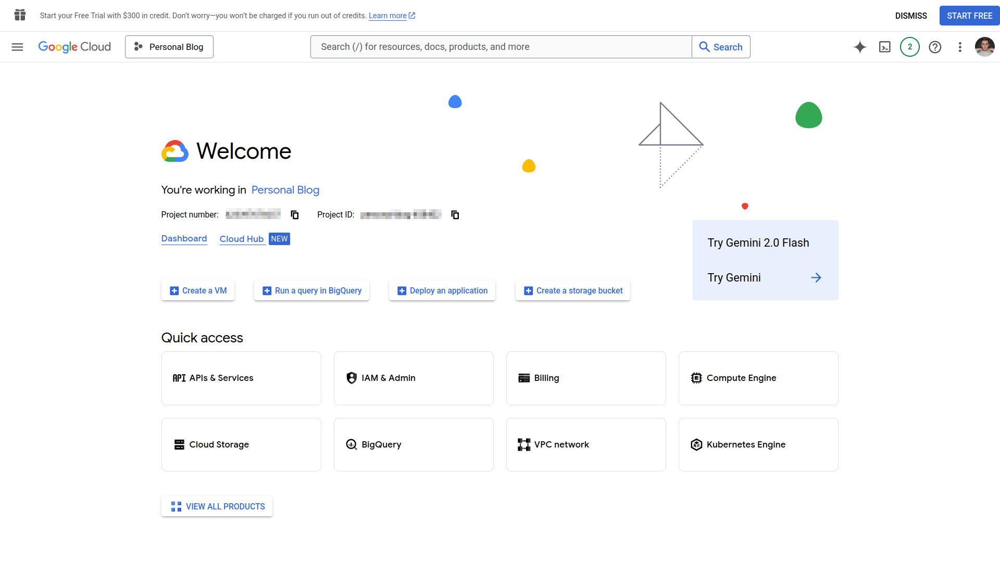
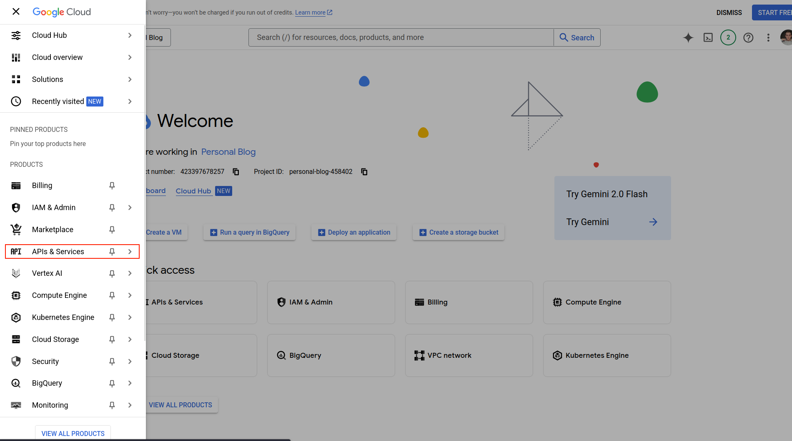
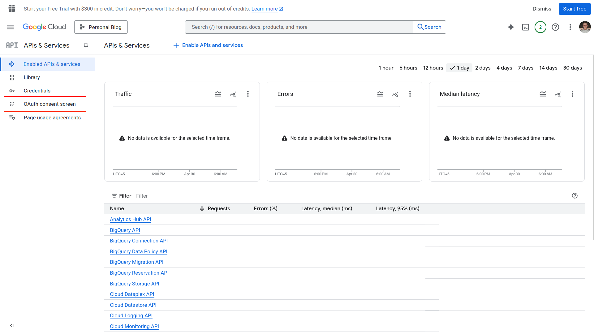
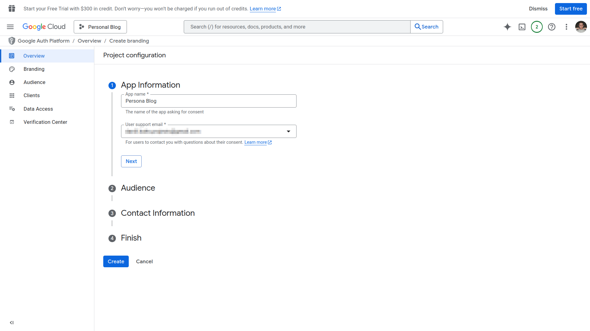
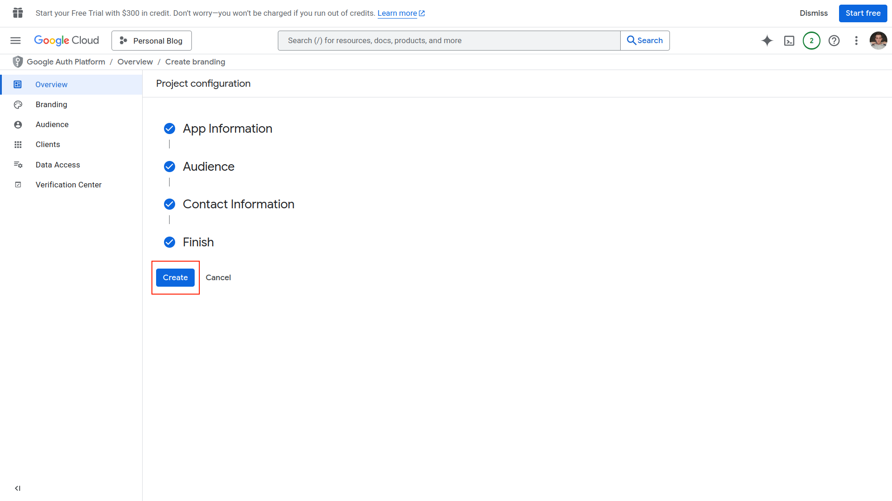
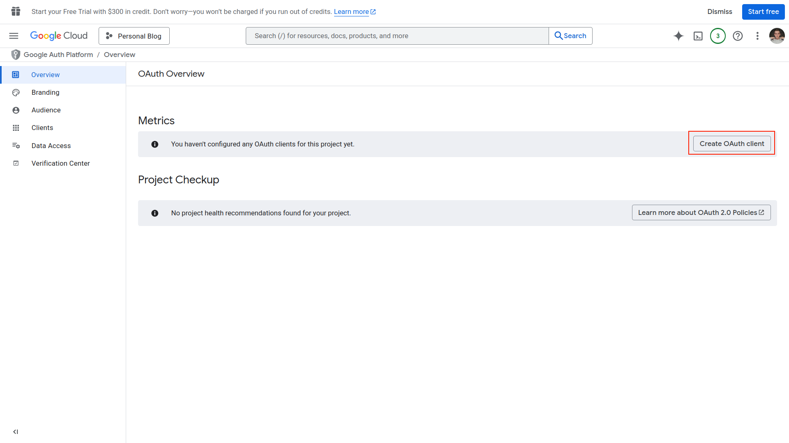
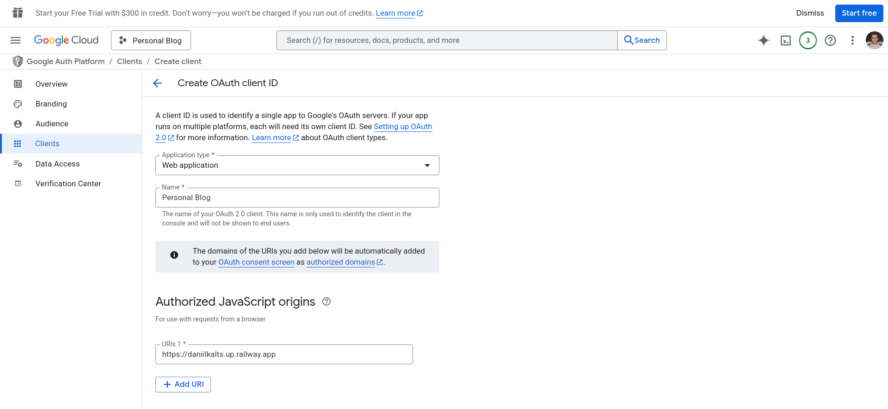
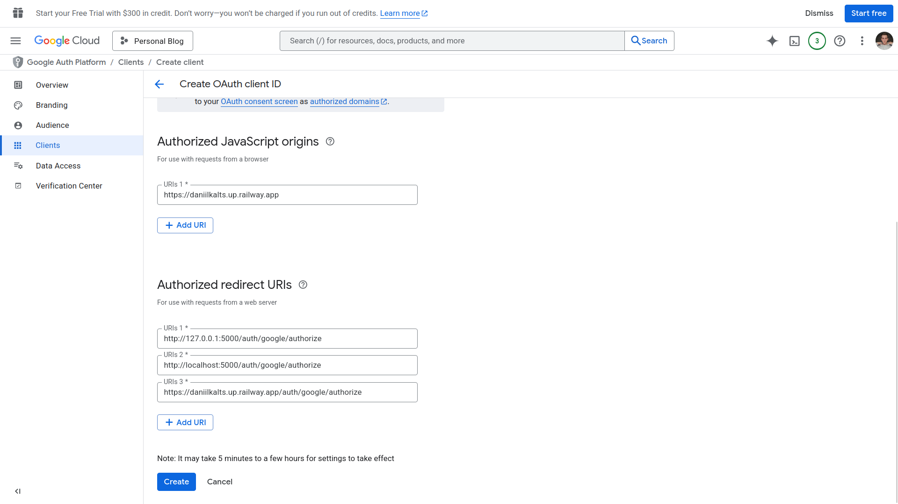

### 01. Open the Google Developer Console
If you don't know how to do that, just go back to the previous guide  
 

### 02. Go to API & Services

### 03. Open OAuth Consent Screen

### 04. Fill in the App Information

### 05. Create a New Project

### 06. Create OAuth Client

### 07. Choose “Web Application” and Name It
Replace with your own credentials

### 08. Add Authorized Redirect URIs and Create OAuth Client
Replace with your own values

### 09. Refresh the Page
And boom, you have:
- **Client ID**
- **Client Secret**

Paste them into your `.env`.  

