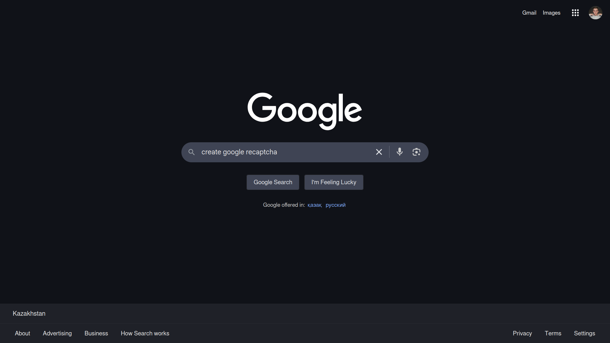
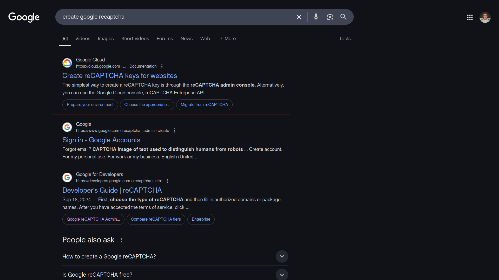
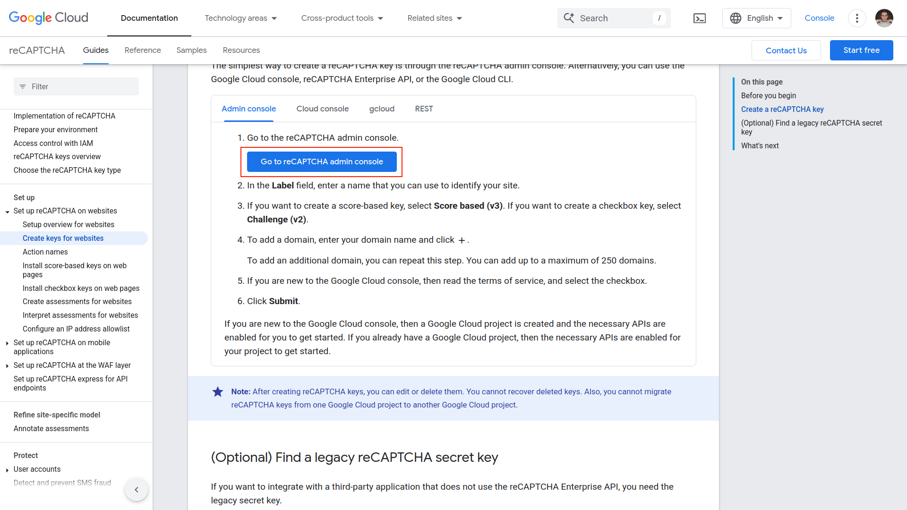
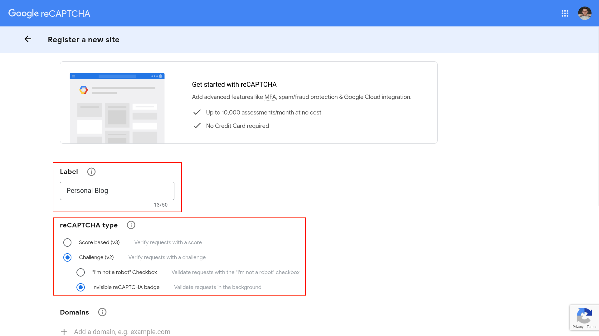
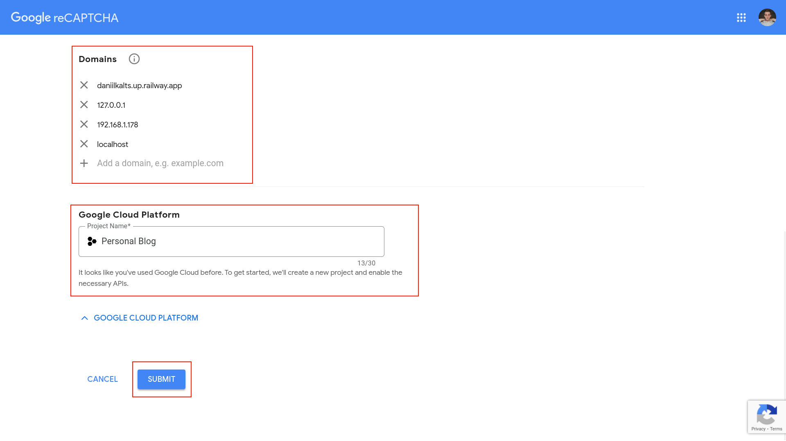
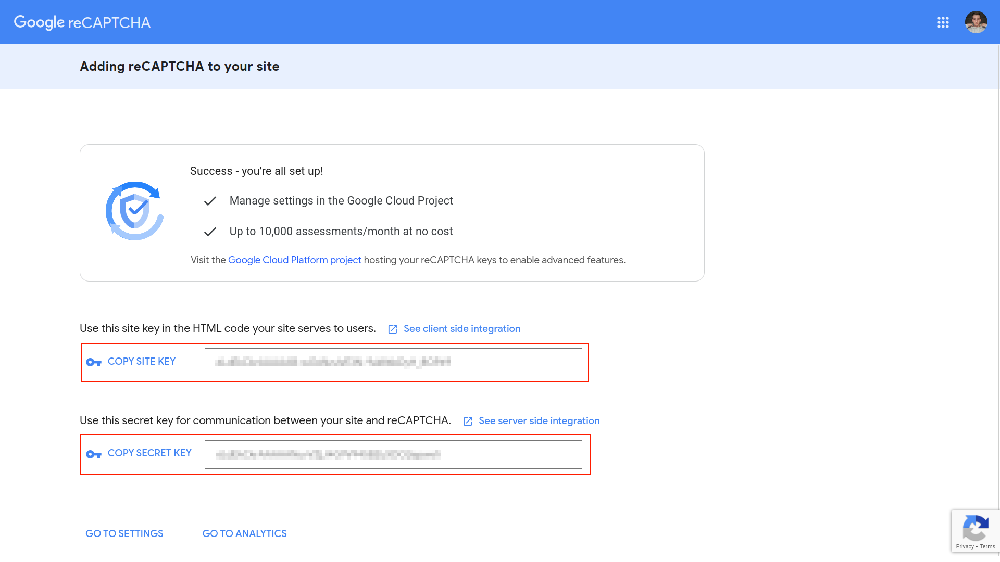

### 01. Search for Create Google Recaptcha

### 02. Open the Official Website

### 03. Go to Recaptcha Admin Console

### 04. Set Name for the Project and use Recaptcha (v2)

### 05. Add Domain Name and Choose Google Cloud Platform

### 06. Copy and Paste Credentials to Environmental Variables
Boom, you have:
- **Site Key**
- **Secret Key**

Paste them into your `.env`.

